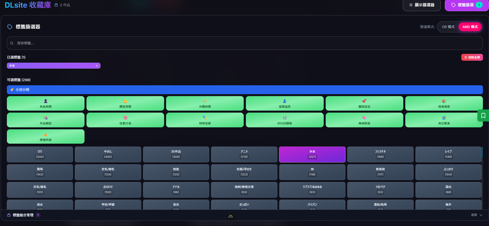
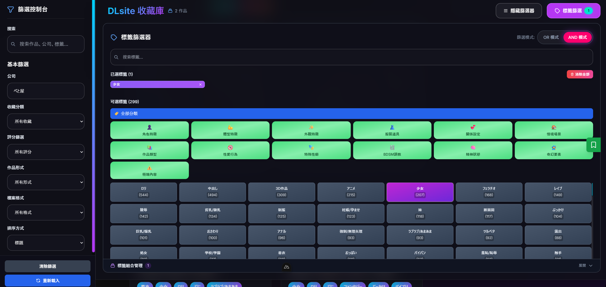

# DLsite Classification Manager

語言 Languages: [English](README.md) | [繁體中文](README.zh-TW.md) | [简体中文](README.zh-CN.md) | [日本語](README.ja.md)

一個高效能的 DLsite 作品分類與管理工具，提供 FastAPI 後端與 Nuxt 3 Web UI。

## 🌟 功能特色

- 非同步爬蟲與檔案處理
- 互動式 CLI 流程：分類、更新、驗證、封存
- FastAPI REST API：搜尋、篩選、分頁與完整元資料
- Nuxt 3 UI：瀏覽、評分、收藏
- 企業 ARCHIVE 工具：抓取公司全部作品的中繼資料
- 以 `.tag` 檔案儲存，無需資料庫

## 🛠️ 系統需求

- Python 3.10+
- Node.js 18+
- uv
- Yarn（或 npm/pnpm）

## 📦 安裝

### 後端

```
uv venv
source .venv/bin/activate
uv sync
```

### 前端

```
cd dlsite_classification_web
yarn install
```

## 🚀 使用方式

### CLI（互動式）

```
uv run python main.py
```

### API 伺服器

```
uv run python server.py
```

自訂資料路徑 / 主機 / 埠號：

```
uv run python server.py --data-path /path/to/your/dlsite/data --host 0.0.0.0 --port 8001
```

也可透過環境變數指定資料路徑：

```
export DLSITE_DATA_PATH=/path/to/your/dlsite/data
```

### 前端

```
cd dlsite_classification_web
yarn dev
```

開啟 `http://localhost:3000`（若 3000 被占用則為 `http://localhost:3001`）。
前端預設連到 `http://localhost:8001` API。

## 🔧 資料路徑優先序

1) `--data-path`
2) `DLSITE_DATA_PATH`
3) 預設路徑（依序檢查）
   - `./test_game_info`
   - `/mnt/d/R18/DLsite`
   - `./data`

## 📡 API 端點

- `GET /` / `GET /status`
- `GET /works`（搜尋、篩選、排序、分頁）
- `GET /work/{code}`
- `GET /companies` / `GET /companies/list`
- `GET /company/{company_id}/works-status`
- `POST /company/{company_id}/archive`
- `GET /company/{company_id}/archive-info`
- `GET /genres` / `GET /work-formats` / `GET /file-formats`
- `GET /collections`
- `POST /work/{code}/user-data`
- `GET /image?path=<url-encoded-path>`
- `GET /scan`

Swagger UI：`http://localhost:8001/docs`

## 📊 資料格式

```
[公司名稱]_[公司ID]/
├── [作品ID]_[公司名稱]_[公司ID] 作品標題/
│   └── [作品ID]_info/
│       ├── [作品ID]_img_main.jpg
│       ├── [作品ID]_img_smp1.jpg
│       ├── code.tag
│       ├── title.tag
│       ├── company.tag
│       └── ... 其他標籤檔
└── ARCHIVE/
    └── RJ123456_info/
        ├── title.tag
        └── ... 封存資訊
```

## 🧪 開發

```
uv run ruff check --fix .
uv run ruff format .
uv run mypy .
./run_tests.sh
```

若在 WSL 出現 "bad interpreter"：

```
sed -i 's/\r$//' run_tests.sh && chmod +x run_tests.sh
```

## 📸 Web 介面預覽





## 🔗 連結

- 專案首頁：https://github.com/DennySORA/DLsite-Classification-Manager
- 問題回報：https://github.com/DennySORA/DLsite-Classification-Manager/issues
- 授權條款：LICENSE
